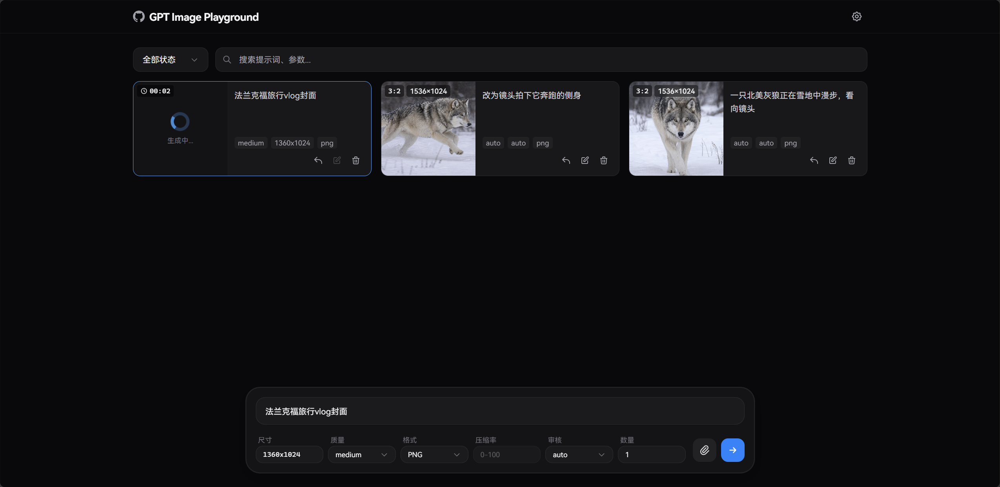
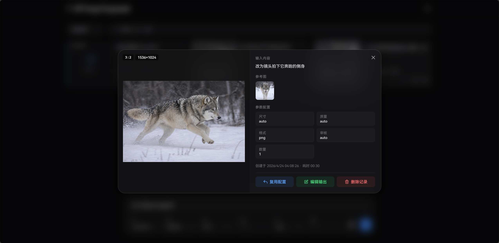

# GPT Image Playground

基于 OpenAI `gpt-image-2` 接口的图片生成与编辑工具。提供简洁的 Web UI，支持文本生成图片、参考图编辑、可视化参数调节、历史记录管理与本地数据导入导出。

**Vercel 部署版本在线体验：** [https://gpt-image-playground.cooksleep.dev](https://gpt-image-playground.cooksleep.dev)

---

## 📸 示例截图

<div align="center">
  <b>主界面</b><br>
  
</div>

<br>

<div align="center">
  <b>任务详情</b><br>
  
</div>

<br>

<div align="center">
  <b>移动端适配</b><br>
  
</div>

---

## ✨ 功能特性

### 🎨 核心能力
- **文本生图**：输入提示词，调用 `images/generations` 接口生成图片。
- **参考图编辑**：支持上传最多 16 张参考图，调用 `images/edits` 接口进行图片编辑。支持文件选择、粘贴和拖拽三种方式。
- **批量生成**：单次可设置生成多张图片。

### ⚙️ 精细化参数控制
- **智能尺寸选择器**：支持 `auto`、按 `1K / 2K / 4K` 结合常用比例自动计算分辨率，同时也支持手动输入自定义宽高。
- **自动规整**：为了兼容模型限制，自定义尺寸会自动向下规整到最接近的 16 倍数。
- **预设反推**：打开尺寸选择弹窗时，会自动根据当前尺寸匹配对应的预设比例。
- **其他选项**：支持调整质量 (`low`, `medium`, `high`)、输出格式 (`PNG`, `JPEG`, `WebP`)、压缩率 (0-100) 以及审核强度。

### 📁 历史记录与工作流
- **瀑布流任务卡片**：直观展示生成缩略图、提示词、参数和耗时。支持按状态筛选与关键词搜索。
- **快速复用**：一键将历史记录的配置与提示词回填到输入框。
- **迭代生成**：支持将生成的输出结果直接添加到参考图列表中，进行下一轮迭代编辑。
- **画廊与详情**：点击任务卡片可查看完整输入输出，支持大图浏览。
- **快捷操作**：支持图片右键或移动端长按唤出自定义菜单，快速复制或下载图片。

### 💾 本地数据优先
- **IndexedDB 存储**：所有任务记录与图片数据均存储在浏览器的 IndexedDB 中，数据绝不离开本地。
- **性能优化**：参考图采用内存缓存与延迟存储机制，图片采用 SHA-256 哈希自动去重，并在每次启动时自动清理孤立的图片碎片。
- **导入与导出**：支持将完整数据打包为 ZIP 导出。导出的 ZIP 内包含原始图片文件（非 base64）和记录图片元数据的 `manifest.json`，方便备份与迁移。

---

## 🚀 部署与使用

支持多种部署与使用方式，推荐使用 Vercel 一键部署。

<details>
<summary><strong>▲ 方式一：Vercel 一键部署 (推荐)</strong></summary>

[](https://vercel.com/new/clone?repository-url=https%3A%2F%2Fgithub.com%2FCookSleep%2Fgpt_image_playground&project-name=gpt-image-playground&repository-name=gpt-image-playground)

点击上方按钮后，按 Vercel 页面提示导入仓库即可。项目已包含 `vercel.json`，Vercel 会自动执行 `npm install`、`npm run build`，并将 `dist/` 作为静态输出目录。

如需预置默认 API 节点，可在 Vercel 项目的 **Settings → Environment Variables** 中添加：

```bash
VITE_DEFAULT_API_URL=https://api.openai.com
```

部署完成后，打开 Vercel 分配的域名，在页面右上角设置中填入 API Key 即可使用。

**更新说明：**

- 如果你是通过一键按钮部署，Vercel 通常会为你创建一份自己的 Git 仓库，并从该仓库自动部署。
- 后续想更新到本项目最新版时，请先将你的仓库同步到本仓库最新代码，再让 Vercel 重新部署。
- 如果你的仓库是 Fork，可以在 GitHub 仓库页面点击 **Sync fork** 同步；同步后，Vercel 会按你的项目设置自动部署。
- 如果你关闭了 Vercel 自动部署，也可以在 Vercel 项目的 **Deployments** 页面手动 Redeploy 最新提交。

</details>

<details>
<summary><strong>🐳 方式二：Docker 部署</strong></summary>

项目已将镜像发布至 GitHub Container Registry。你可以通过环境变量 `API_URL` 注入默认的 API 节点。

**使用 Docker CLI：**

```bash
docker run -d -p 8080:80 \
  -e API_URL=https://api.openai.com \
  ghcr.io/cooksleep/gpt_image_playground:latest
```

**使用 Docker Compose：**

```yaml
services:
  gpt-image-playground:
    image: ghcr.io/cooksleep/gpt_image_playground:latest
    environment:
      - API_URL=https://api.openai.com
    ports:
      - "8080:80"
    restart: unless-stopped
```

浏览器访问 `http://localhost:8080`，在页面右上角设置中填入 API Key 即可使用。

*(注：官方镜像同时提供带版本号的标签，如 `0.1.11` 或 `0.1`)*

**更新说明：**

- 使用 `latest` 标签时，重新拉取镜像并重启容器即可更新到最新发布版本。
- 如果希望固定版本，建议使用明确版本号标签，例如 `ghcr.io/cooksleep/gpt_image_playground:0.2.3`。
- Docker Compose 更新示例：

```bash
docker compose pull
docker compose up -d
```

</details>

<details>
<summary><strong>💻 方式三：本地开发与自行构建</strong></summary>

1. **环境准备 (可选)**
   你可以在项目根目录新建 `.env.local` 文件，配置构建时的默认 API URL：
   ```bash
   VITE_DEFAULT_API_URL=https://api.openai.com
   ```

2. **安装依赖与启动开发服务器**
   ```bash
   npm install
   npm run dev
   ```
   随后浏览器访问 `http://localhost:5173`。

3. **本地开发跨域代理（可选）**
   如果你的图片接口没有放开浏览器跨域，前端直接请求接口时可能会被浏览器的 CORS 策略拦截。这个可选代理用于本地开发调试：浏览器先请求同源的 Vite 开发服务器，再由 Vite 开发服务器转发到真实接口。

   请求链路如下：

   ```text
   浏览器页面 http://localhost:5173
     -> 同源请求 http://localhost:5173/api-proxy/v1/images/generations
     -> Vite 开发服务器代理转发
     -> 真实接口 http://127.0.0.1:3000/v1/images/generations
   ```

   这样浏览器看到的是同源请求，实际跨域请求发生在 Vite 开发服务器这一侧，从而绕开浏览器 CORS 限制。

   注意：这个代理只在 `npm run dev` 启动的 Vite 开发服务器中生效。它不会打包进静态产物，也不会在 Vercel、GitHub Pages 或普通 Nginx 静态部署中生效。

   先复制示例配置：
   ```bash
   cp dev-proxy.config.example.json dev-proxy.config.json
   ```
   然后修改项目根目录下的本地 `dev-proxy.config.json`：
   ```json
   {
     "enabled": true,
     "prefix": "/api-proxy",
     "target": "http://127.0.0.1:3000",
     "changeOrigin": true,
     "secure": false
   }
   ```
   配置含义：

   - `enabled`：是否启用本地开发代理。
   - `prefix`：前端同源请求使用的代理路径前缀。
   - `target`：真实图片接口地址，也就是 Vite 开发服务器要转发到的后端。
   - `changeOrigin`：转发时是否把请求头中的 `Host` 改成 `target` 的主机名，通常建议保持 `true`。
   - `secure`：当 `target` 是 HTTPS 时是否校验证书；本地自签名证书可设为 `false`。

   修改配置后需要重新启动开发服务器，并在页面设置中的 `API URL` 填入与 `target` 相同的地址。当前端发现 `API URL` 与 `target` 匹配时，会把请求改写为 `prefix` 开头的同源地址，例如 `/api-proxy/v1/images/generations`。

   如果需要在线上部署中使用代理，请使用 Vercel Function、Cloudflare Worker、Nginx 反向代理或自建后端等服务端方案。

4. **构建静态产物**
   ```bash
   npm run build
   ```
   构建输出的文件会存放在 `dist/` 目录下，你可以将其部署到任何静态文件服务器（如 Nginx、Vercel、Netlify 等）。

</details>

---

## 🛠️ API 配置说明

点击页面右上角的设置图标，你可以随时更改 API 相关的配置。
应用支持通过 URL 查询参数快速填充配置，非常适合书签或分享给他人使用：
- `?apiUrl=https://你的代理地址.com`
- `?apiKey=sk-xxxx`

例如：
- 接入 New API 聊天应用：
  ```
  https://cooksleep.github.io/gpt_image_playground?apiUrl={address}&apiKey={key}
  ```

---

## 💻 技术栈

- **框架**：[React 19](https://react.dev/) + [TypeScript](https://www.typescriptlang.org/)
- **构建工具**：[Vite](https://vite.dev/)
- **样式**：[Tailwind CSS 3](https://tailwindcss.com/)
- **状态管理**：[Zustand](https://zustand.docs.pmnd.rs/)
- **数据存储**：浏览器的 IndexedDB API

## 📄 许可证

[MIT License](LICENSE)

## 🔗 致谢

[LINUX DO](https://linux.do)
